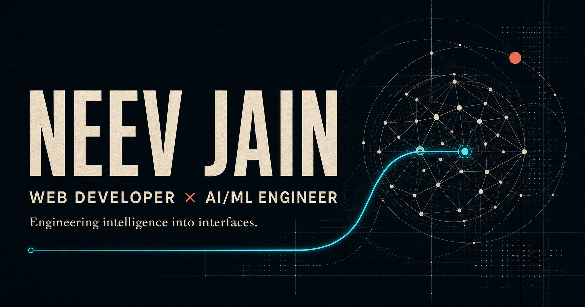

# Neev Jain - Portfolio

An interactive portfolio presenting my work across web development, artificial intelligence, and machine learning.

Built with Next.js, TypeScript, and Anime.js, the site combines an editorial visual direction with technical system diagrams, responsive layouts, and accessible motion.



## About the portfolio

The portfolio is designed around one central idea: **engineering intelligence into interfaces**. It introduces my background in Computer Engineering at Boston University and highlights projects involving computer vision, natural language processing, adaptive learning, automation, and real-time web applications.

The content is based on my résumé and professional profiles. Project results, experience details, and credentials are intentionally kept evidence-based.

## Highlights

- Editorial hero section with an animated portrait presentation
- Interactive canvas-based network field
- Featured AI/ML projects with system-flow visualizations
- Additional project archive sourced from my résumé
- Switchable AI/ML and web-development skill collections
- Experience, education, and certification timeline
- Downloadable résumé and direct contact links
- Responsive desktop, tablet, and mobile layouts
- Keyboard-visible interaction states and semantic page structure
- Reduced-motion support for accessible animation
- Open Graph and X social-preview metadata

## Featured work

The portfolio currently presents three featured systems:

1. **Vehicle Speed Detection** — vehicle detection, multi-object tracking, and speed estimation using YOLO, DeepSORT, Python, and OpenCV.
2. **Gideon — Voice Assistant** — speech recognition and transformer-based intent understanding for an AI-powered voice interface.
3. **Personalized Learning Assistant** — an adaptive learning application that uses performance data to recommend lessons, quizzes, and targeted feedback.

Additional work includes a Discord clone, cryptojacking attack analysis, and GenZ Script—a programming language built with a custom lexer and parser.

## Technology

| Area         | Tools                                 |
| ------------ | ------------------------------------- |
| Framework    | Next.js 16 App Router                 |
| Interface    | React 19, TypeScript                  |
| Animation    | Anime.js                              |
| Styling      | CSS, Tailwind CSS PostCSS integration |
| Fonts        | Geist Sans, Geist Mono                |
| Images       | Next.js Image                         |
| Testing      | Node.js test runner                   |
| Code quality | ESLint, Next.js Core Web Vitals rules |

## Project structure

```text
Portfolio/
├── app/
│   ├── globals.css        # Design tokens, layouts, motion, and responsive rules
│   ├── layout.tsx         # Fonts, metadata, and root document structure
│   └── page.tsx           # Portfolio content, interactions, and Anime.js motion
├── public/
│   ├── neev-jain.jpeg     # Browser-served portrait
│   ├── og.png             # Social sharing preview
│   └── Resume.pdf         # Downloadable résumé
├── tests/
│   └── rendered-html.test.mjs
├── next.config.ts
├── package.json
└── tsconfig.json
```

## Run locally

### Requirements

- Node.js 22.13 or newer
- npm

### Installation

Clone or download the repository, then run:

```bash
cd Portfolio
npm install
npm run dev
```

Open [http://localhost:3000](http://localhost:3000) in your browser.

## Available commands

```bash
npm run dev      # Start the development server
npm run lint     # Run ESLint
npm run build    # Create and type-check a production build
npm test         # Build the site and run rendered-content tests
npm run start    # Serve an existing production build
```

## Accessibility and motion

The site respects `prefers-reduced-motion`, keeps important content visible when animation is unavailable, includes a skip link, and preserves visible keyboard focus states. Interactive project cards and navigation links remain usable with keyboard and touch input.

## Content policy

Personal facts, project descriptions, experience, and education details are sourced from my résumé, LinkedIn profile, and previous portfolio materials. The site avoids invented credentials or unsupported performance claims.

## Connect

- [GitHub](https://github.com/neevj2006)
- [LinkedIn](https://www.linkedin.com/in/neevj2006)
- [Email](mailto:neevj2006@gmail.com)

---

Designed and developed by **Neev Jain**.
