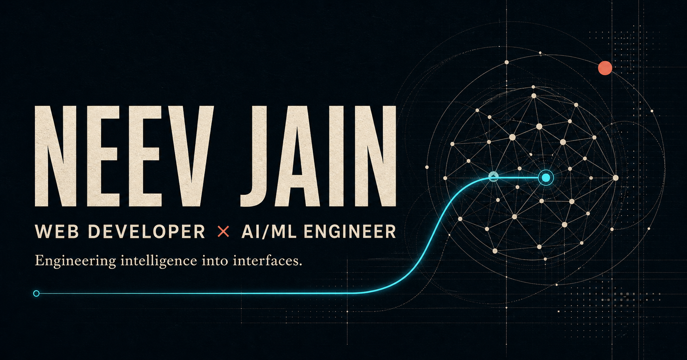

# Neev Jain - Portfolio

An interactive portfolio presenting my work across web development, artificial intelligence, and machine learning.

Built with Next.js, TypeScript, and Anime.js, the site combines an editorial visual direction with technical system diagrams, responsive layouts, and accessible motion.



## About the portfolio

Neev Jain is a Boston University B.Sc. Computer Engineering student with a machine learning concentration, expected graduation in December 2027, a 3.7/4.0 GPA, and Dean's List recognition. Seeking Summer 2027 AI/ML and full-stack software engineering internships.

**AI/ML x Web Developer — From models to working software.**

## Projects

Four featured projects:

1. [FraudGraph](https://github.com/neevj2006/FraudGraph) — temporal graph fraud investigation; local staging with documented benchmark limits.
2. [SpecGuard](https://github.com/neevj2006/SpecGuard) — requirement-to-code review with file-and-line evidence; local development preview.
3. [DevRelay](https://github.com/neevj2006/DevRelay) — monitoring and incident response; 201 automated checks. [Live demo](https://devrelay-delta.vercel.app/) uses seeded data.
4. [F1 Race Predictor](https://github.com/neevj2006/F1_Race_Predictor) — research MVP; mean Spearman 0.754 across five held-out 2026 races (rounds 7–11), with rounds 1–6 used for model selection.

Four archive projects:

5. [Gideon](https://github.com/neevj2006/Gideon) — local Windows voice and CLI assistant with optional cloud model fallback.
6. [TransitPulse](https://github.com/neevj2006/TransitPulse) — MBTA transit data and full-stack application. [Live demo](https://transit-pulse-web.vercel.app).
7. [Discord Clone](https://github.com/neevj2006/discord-clone) — real-time communication with Socket.io and LiveKit; source and local setup.
8. [Vehicle Speed Detection](https://github.com/neevj2006/Vehicle_Speed_Detection) — recorded-video tracking and calibration-dependent speed estimates.

The page retains its animated portrait, canvas, diagrams, skill switcher, experience/education timeline, and three engineering-practice cards.

## Resumes

- [AI/ML resume](public/Resume.pdf)
- [Full-stack resume](public/Resume-FullStack.pdf)

Both are the supplied PDFs, offered as distinct downloads. `/Resume.pdf` remains the AI/ML destination for existing links.

## Technology

| Area         | Tools                                 |
| ------------ | ------------------------------------- |
| Framework    | Next.js 16 App Router                 |
| Interface    | React 19, TypeScript                  |
| Animation    | Anime.js                              |
| Styling      | CSS, Tailwind CSS PostCSS integration |
| Fonts        | Geist Sans, Geist Mono                |
| Images       | Next.js Image                         |
| Testing      | Node.js test runner                   |
| Code quality | ESLint, Next.js Core Web Vitals rules |

## Project structure

```text
Portfolio/
├── app/
│   ├── globals.css        # Design tokens, layouts, motion, and responsive rules
│   ├── layout.tsx         # Fonts, metadata, and root document structure
│   └── page.tsx           # Portfolio content, interactions, and Anime.js motion
├── public/
│   ├── neev-jain.jpeg     # Browser-served portrait
│   ├── og.png             # Social sharing preview
│   └── Resume.pdf         # AI/ML resume (Full-stack: Resume-FullStack.pdf)
├── tests/
│   └── rendered-html.test.mjs
├── next.config.ts
├── package.json
└── tsconfig.json
```

## Run locally

### Requirements

- Node.js 22.13 or newer
- npm

### Installation

Clone or download the repository, then run:

```bash
cd Portfolio
npm install
npm run dev
```

Open [http://localhost:3000](http://localhost:3000) in your browser.

## Available commands

```bash
npm run dev      # Start the development server
npm run lint     # Run ESLint
npm run build    # Create and type-check a production build
npm test         # Build the site and run rendered-content tests
npm run start    # Serve an existing production build
```

## Accessibility and motion

The site respects `prefers-reduced-motion`, keeps important content visible when animation is unavailable, includes a skip link, and preserves visible keyboard focus states. Interactive project cards and navigation links remain usable with keyboard and touch input.

## Content policy

Personal facts, project descriptions, experience, and education details follow the owner-supplied copy and current resumes. The site avoids invented credentials or unsupported performance claims.

## Connect

- [GitHub](https://github.com/neevj2006)
- [LinkedIn](https://www.linkedin.com/in/neevj2006)
- [Email](mailto:neevj2006@gmail.com)

---

Designed and developed by **Neev Jain**.
